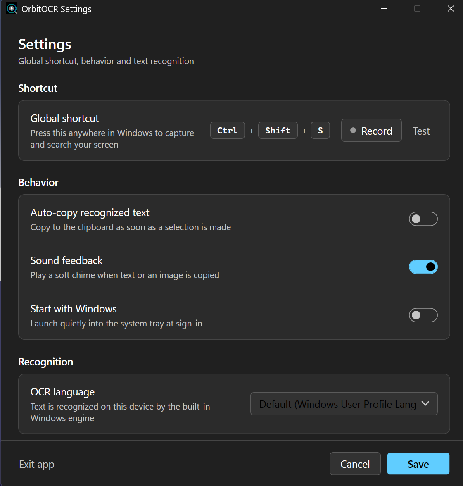

# OrbitOCR

**Circle-to-Search for Windows — offline screen OCR and visual search in one hotkey.**

OrbitOCR lives in your system tray. Press `Ctrl + Shift + S` (configurable), your desktop freezes across every monitor, and you can click or drag over any text to copy or search it, or draw a freehand circle around any image to search it with Google Lens. Text recognition runs entirely on the built-in Windows OCR engine — no cloud, no telemetry, no Tesseract, no Python.

[](https://github.com/torpidno/OrbitOCR/actions/workflows/build.yml)
[](https://github.com/torpidno/OrbitOCR/releases)
[](https://github.com/torpidno/OrbitOCR/blob/main/LICENSE)
[](#prerequisites)
[](https://dotnet.microsoft.com/download/dotnet/8.0)
[](#contributing)

<div align="center">
  <!-- Replace this placeholder with a real screenshot or GIF, e.g.:
  
  -->
  <sub><strong>Demo placeholder</strong> — add a screenshot/GIF at <code>docs/preview.png</code> and embed it here.</sub>
</div>

## Table of Contents

- [Key Features](#key-features)
- [Getting Started](#getting-started)
  - [Prerequisites](#prerequisites)
  - [Install for end users](#install-for-end-users)
  - [Build from source](#build-from-source)
  - [Run the tests](#run-the-tests)
  - [Publish a standalone executable](#publish-a-standalone-executable)
- [Usage Guide](#usage-guide)
- [Configuration & Shortcuts](#configuration--shortcuts)
- [Architecture & Tech Stack](#architecture--tech-stack)
- [Contributing](#contributing)
- [License](#license)
- [Acknowledgments](#acknowledgments)

## Key Features

- **100% offline OCR** — powered by the native Windows 10/11 `Windows.Media.Ocr` engine. Zero cloud APIs, zero telemetry, zero external runtimes. The explicit **Search Google** / **Search with Lens** actions are the only features that send data off-device, and only when you click them.
- **Circle-to-Search interaction** — inspired by Google Pixel.
  - **Auto screen scan**: on trigger, the whole virtual desktop is OCR'd in one background pass (typically ~150–250 ms) and every detected word becomes interactive.
  - **Direct text interaction**: hovering a word shows a soft glow and switches to an `IBeam` cursor; click a word or drag across a phrase to select it in reading order.
  - **Freehand circling**: draw a lasso around any object, photo, or UI region to enter image mode — with a glowing cyan trail, a live dimensions badge, and draggable corner handles to refine the selection.
  - **Dimming mask cut-out** keeps your active selection at 100% brightness while the rest of the screen dims.
- **Context-aware floating action pill**
  - *Text mode*: **Copy Text** (with a synthesized chime and tray toast) and **Search Google**.
  - *Image mode*: **Search with Lens** (uploads the crop straight into Google Lens via the browser — no clipboard paste), **Copy Image**, **Save Image** (PNG/JPEG), plus **Copy Text** when text is detected inside the circle.
- **Multi-monitor virtual desktop capture** — captures all displays, including negative virtual-screen coordinates, and is PerMonitorV2 DPI-aware to prevent blur and coordinate drift.
- **Global hotkey, no polling** — registered through the Win32 `RegisterHotKey` API and a hidden message pump. Defaults to `Ctrl + Shift + S`; fully remappable from Settings (at least one modifier or an `F1`–`F12` key is required to avoid accidental triggers).
- **Background-first lifecycle** — single-instance mutex, tray balloon on launch, and aggressive working-set trimming after every snip (idle footprint ~30 MB).
- **OCR with small-text boost** — crops up to 1500 × 1500 px are rescaled 2× with high-quality bicubic interpolation before recognition, significantly improving accuracy on small UI fonts.
- **Language-aware** — defaults to your Windows user-profile OCR languages, with a configurable picker over every installed recognizer language pack.
- **Fluent dark UI** — custom WPF design system (accent `#60CDFF`), DWM immersive dark title bar, and automation names/live regions for screen readers.

## Getting Started

### Prerequisites

| Requirement | Details |
|---|---|
| OS | Windows 10 **version 2004 (build 19041)** or later, or Windows 11 — x64 |
| Runtime (end users) | None. Use the self-contained build; no .NET installation required |
| Runtime (developers) | [.NET 8.0 SDK](https://dotnet.microsoft.com/download/dotnet/8.0) or newer |
| OCR language pack | Installed via **Settings → Time & Language → Language & region** for any language you want to recognize (English ships with Windows) |
| Optional | Visual Studio 2022 17.8+ (workload *.NET desktop development*) or VS Code + C# Dev Kit |

### Install for end users

No installer and no admin rights required — OrbitOCR is a portable single executable (`asInvoker` manifest).

1. Download the latest `OrbitOCR.exe` from the [Releases](https://github.com/torpidno/OrbitOCR/releases) page.
2. Put it in any folder (e.g. `%LOCALAPPDATA%\Programs\OrbitOCR`) and run it. Since the binary is unsigned, Windows SmartScreen may show a warning on first launch — choose **More info → Run anyway**.
3. On first start the **Settings** window opens. Press **Test** or the global hotkey to try a snip.
4. Optional: enable **Start with Windows** in Settings to add OrbitOCR to your sign-in.
5. It now lives in the notification tray. Right-click the tray icon for `Trigger snip`, `Settings…`, `About OrbitOCR`, and `Exit`.

> If no release is published yet, use [Build from source](#build-from-source) — the publish step produces the same single-file executable.

### Build from source

```powershell
git clone https://github.com/torpidno/OrbitOCR.git
cd OrbitOCR

# Restore, compile, run (opens the Settings window)
dotnet build
dotnet run

# Or start straight to the tray, skipping the Settings window
dotnet run -- --minimized
```

The app targets `net8.0-windows10.0.19041.0` with WPF enabled, so build and run commands must be executed on Windows.

### Run the tests

```powershell
dotnet test tests/OrbitOCR.Tests.csproj
```

13 automated tests (MSTest) cover bitmap cropping and clamping, settings defaults and hotkey formatting, OCR language discovery, virtual-screen bounds, end-to-end OCR on clear and small dark-mode text, the Lens upload payload contract, PNG encoding, and XAML/resource smoke tests for every view.

> The OCR end-to-end tests require a desktop session with at least one installed Windows OCR language pack.

### Publish a standalone executable

Creates a self-contained, compressed, single-file `OrbitOCR.exe` with the .NET runtime bundled:

```powershell
dotnet publish -c Release -r win-x64 --self-contained true `
  -p:PublishSingleFile=true `
  -p:IncludeNativeLibrariesForSelfExtract=true `
  -p:EnableCompressionInSingleFile=true `
  -o ./publish
```

Output: `./publish/OrbitOCR.exe` — copy it to any folder, USB drive, or startup directory (`publish/` is git-ignored).

## Usage Guide

1. **Trigger** — press your global hotkey (default `Ctrl + Shift + S`), left-click the tray icon, or pick `Trigger snip` from the tray menu.
2. **Wait for the scan** — the desktop freezes, dims, and the top pill reports how many words were detected.
3. **Interact**:
   - Click any underlined word, or drag across several, to select text. A pill appears with **Copy Text** and **Search Google**.
   - Clicking or drawing anywhere that isn't text starts a freehand lasso. Release to capture that region as an image; drag the corner handles to adjust it.
4. **Act** on the pill (copy, search, save), or press `Esc` to dismiss everything.

### Everyday examples

| Goal | Steps |
|---|---|
| Copy text from a video, PDF, or app that blocks selection | Hotkey → click/drag the words → **Copy Text** (or `Ctrl + C`) |
| Look up an error message | Hotkey → drag the message → **Search Google** |
| Identify a product, landmark, or plant | Hotkey → circle it → **Search with Lens** |
| Save a region as an image | Hotkey → lasso the region → **Save Image** → choose PNG/JPEG |
| Reuse a screenshot in a chat | Hotkey → lasso the region → **Copy Image** → paste anywhere |
| Grab text without clicking the pill | Enable **Auto-copy recognized text** in Settings — the selection is copied the moment you release the mouse |

**Text mode** (words detected under the cursor):

| Action | Description |
|---|---|
| Click a word | Selects the single word |
| Drag across words | Selects the phrase in reading order, preserving spaces |
| **Copy Text** / `Ctrl + C` | Clipboard + chime + tray toast, then closes the overlay |
| **Search Google** | Opens `https://www.google.com/search?q=…` in the default browser |
| **Esc** | Cancels the snip immediately |

**Image mode** (circle or drag a non-text region):

| Action | Description |
|---|---|
| **Search with Lens** | Encodes the crop and hands it to Google Lens through your default browser via a self-submitting temp page (deleted after 2 minutes; stale files swept on startup). Falls back to clipboard + lens.google.com if the hand-off fails |
| **Copy Image** | Puts the cropped bitmap on the clipboard |
| **Save Image** | Save-as dialog; defaults to `OrbitOCR_yyyyMMdd_HHmmss.png`, PNG or JPEG |
| **Copy Text** | Appears only when text was detected inside the region; runs OCR on the crop with the 2× upscale boost |
| Corner handles | Resize the lasso bounding box before acting |

### Tray menu

| Item | Description |
|---|---|
| **Trigger snip** | Same as the global hotkey (the configured shortcut is shown as its gesture) |
| **Settings…** | Shortcut recorder, behavior toggles, and OCR language |
| **About OrbitOCR** | Version and credits |
| **Exit** | Fully unregisters the hotkey and removes the tray icon |

> Left-clicking or double-clicking the tray icon also triggers a snip.

## Configuration & Shortcuts

### Keyboard shortcuts

| Shortcut | Context | Action |
|---|---|---|
| `Ctrl + Shift + S` | Global (default, configurable) | Trigger a snip |
| `Ctrl + C` | Overlay, text selected | Copy the selected text and close the overlay |
| `Esc` | Overlay / shortcut recorder | Cancel the snip / stop recording |
| `F1`–`F12` | Global | Function keys are valid hotkeys without any modifier |

Hotkey validation: a combination must include at least one of `Ctrl`, `Shift`, `Alt`, `Win`, **or** be a function key (`F1`–`F12`). Assignments that would swallow ordinary typing are rejected when saving.

### Settings window

| Setting | Default | Description |
|---|---|---|
| **Global shortcut** | `Ctrl + Shift + S` | Click **Record**, press the combination, then **Save**. **Test** fires a snip immediately |
| **Auto-copy recognized text** | Off | Copies the selection to the clipboard as soon as the mouse is released over text |
| **Sound feedback** | On | Plays a synthesized 80 ms harmonic chime on copy (no audio assets — the WAV is generated in memory) |
| **Start with Windows** | Off | Adds `"OrbitOCR.exe" --minimized` to `HKCU\Software\Microsoft\Windows\CurrentVersion\Run`, so sign-in boots straight to the tray |
| **OCR language** | Default (Windows user profile) | Any installed `Windows.Media.Ocr` recognizer language; falls back to the user profile, then to the first available language |

### Settings file

Settings persist as JSON at `%APPDATA%\OrbitOCR\settings.json`. The file is created on first save; a corrupt file silently falls back to defaults.

| Key | Type | Default | Description |
|---|---|---|---|
| `HotkeyCtrl` | bool | `true` | Include `Ctrl` in the global hotkey |
| `HotkeyShift` | bool | `true` | Include `Shift` |
| `HotkeyAlt` | bool | `false` | Include `Alt` |
| `HotkeyWin` | bool | `false` | Include `Win` |
| `HotkeyKey` | string | `"S"` | Key name (`Key` enum name or a single character) |
| `DefaultSelectionMode` | enum | `"Rectangle"` | Reserved — the current overlay auto-detects text vs. image from the cursor position |
| `AutoCopyOnSnip` | bool | `false` | Copy text automatically when a text selection ends |
| `PlaySounds` | bool | `true` | Play the copy chime |
| `StartWithWindows` | bool | `false` | Register/unregister the `HKCU\...\Run` entry (launches with `--minimized`) |
| `PreferredOcrLanguage` | string? | `null` | BCP-47 tag (e.g. `"de-DE"`); `null` follows Windows user-profile languages |

### Command-line flags

| Flag | Effect |
|---|---|
| `--minimized` / `/minimized` | Start in the tray without opening the Settings window |

## Architecture & Tech Stack

OrbitOCR is a single-process WPF tray application. Services are composed by hand in `App.OnStartup` and communicate through events (`HotkeyTriggered`, `TriggerSnipRequested`, `SettingsChanged`, …), so the UI never talks to Win32 directly and the hotkey, tray, and settings subsystems stay testable and disposable.

| Layer | Technology |
|---|---|
| Runtime | .NET 8 (`net8.0-windows10.0.19041.0`), C# 12, nullable reference types, implicit usings |
| UI | WPF (XAML + code-behind, no MVVM framework), custom Fluent dark design system in `UI/Theme.xaml`, DWM immersive dark title bar |
| OCR | Windows WinRT `Windows.Media.Ocr.OcrEngine` via `Microsoft.Windows.SDK.NET` projection |
| Capture | GDI+ `CopyFromScreen` across `SM_*VIRTUALSCREEN` metrics, `System.Drawing.Common` 8.0.8, high-quality bicubic 2× upscale for crops |
| Interop | Win32 `RegisterHotKey`/`WM_HOTKEY`, `Shell_NotifyIcon`, `SetProcessWorkingSetSize`, `SetWindowPos`, PerMonitorV2 DPI |
| Persistence | `System.Text.Json` → `%APPDATA%\OrbitOCR\settings.json`; `HKCU\...\Run` for startup |
| Lens hand-off | Generated temp HTML that multipart-POSTs the PNG to Google Lens' own upload endpoint, opened in the default browser (temp file lifetime 2 min, stale sweep on startup) |
| Tests | MSTest 3.1.1, Microsoft.NET.Test.Sdk 17.8.0, coverlet.collector 6.0.0 |

### Project structure

```
OrbitOCR/
├── .github/workflows/build.yml     # CI: restore, build, and test on windows-latest
├── LICENSE                         # MIT License
├── app.manifest                    # PerMonitorV2 DPI awareness, Win10/11 compatibility, asInvoker
├── OrbitOCR.csproj                 # net8.0-windows target, version 1.0.0, single-file publish spec
├── App.xaml / App.xaml.cs          # Composition root: tray lifecycle, single-instance mutex, memory trimming
├── Models/
│   ├── AppSettings.cs              # Hotkey, selection mode, sound/startup flags, OCR language
│   └── OcrExtractedResult.cs       # Full text, lines, word/line bounding boxes, word count, angle
├── Services/
│   ├── HotkeyService.cs            # RegisterHotKey + hidden HwndSource message pump (MOD_NOREPEAT)
│   ├── ScreenCaptureService.cs     # Virtual-desktop capture, DIP-aware conversion, clamped cropping
│   ├── OcrService.cs               # OcrEngine wrapper: language selection, 2× upscale, word boxes
│   ├── LensSearchService.cs        # Self-submitting Lens payload page, temp lifecycle, cleanup
│   ├── TrayIconService.cs          # Shell_NotifyIcon, balloons, Fluent dark context menu
│   ├── SoundService.cs             # In-memory synthesized chime (no audio assets)
│   └── SettingsService.cs          # settings.json load/save + startup registry
├── UI/
│   ├── Theme.xaml                  # Fluent dark design tokens, control templates, switches
│   ├── ActionMenu.xaml (.cs)       # Floating pill with contextual text/image actions
│   ├── OverlayWindow.xaml (.cs)    # TopMost frozen-desktop canvas, lasso, mask cutout, word layer
│   └── SettingsWindow.xaml (.cs)   # Hotkey recorder, toggles, OCR language selector
├── Utils/
│   └── IconHelper.cs               # Runtime-generated multi-resolution ICO (16/32/48/64 px)
├── Assets/
│   └── app.ico                     # Application icon
└── tests/
    ├── OrbitOCR.Tests.csproj       # MSTest project
    ├── UnitTest1.cs                # Unit + integration tests (cropping, settings, OCR, Lens payload)
    └── UiSmokeTests.cs             # Parses/lays out every view to catch XAML resource errors
```

### Design notes

- **No polling anywhere.** The global hotkey arrives as a `WM_HOTKEY` message on a hidden window, and the tray icon as `WM_TRAYICON` callbacks.
- **Capture → scan are decoupled.** The full-screen OCR runs asynchronously after the overlay is shown, so the UI stays responsive while words stream in.
- **Memory discipline.** On overlay close, bitmaps and visual canvases are explicitly disposed/cleared, then a full GC plus `SetProcessWorkingSetSize(-1, -1)` trims the working set for an ultra-light tray footprint.
- **Coordinates are kept in DIP space.** Physical pixel word boxes are scaled to canvas coordinates, and crops are scaled back on capture — keeping selection accurate under DPI scaling and multi-monitor setups.

## Contributing

Contributions are welcome — bug reports, fixes, and features alike.

### Reporting bugs

Open an [issue](https://github.com/torpidno/OrbitOCR/issues) and include:

- Windows version/build and monitor layout (single or multi-monitor, DPI scale);
- steps to reproduce and what you expected;
- the OCR language selected and, if relevant, your `%APPDATA%\OrbitOCR\settings.json`;
- screenshots or a screen recording when the overlay misbehaves.

Check for existing issues first, and keep one issue per problem.

### Pull requests

1. Fork the repository and create a topic branch (`fix/lasso-resize`, `feat/tray-theme`).
2. Make your change; keep diffs focused and match the existing style (file-scoped namespaces, nullable enabled, services single-purpose).
3. Build and run the full test suite — CI (`.github/workflows/build.yml`) runs the same restore/build/test flow on Windows for every push and pull request to `main`.
4. Open a PR describing **what** changed and **why**; link any related issue. This project follows a conventional commit style (`feat:`, `fix:`, `docs:`, `test:`).

### Local development environment

```powershell
git clone https://github.com/torpidno/OrbitOCR.git
cd OrbitOCR
dotnet build                 # compile
dotnet run                   # launch on the development desktop
dotnet test tests/OrbitOCR.Tests.csproj
```

- Windows 10 2004+ / Windows 11 with the .NET 8 SDK is required; WPF projects cannot be built on Linux/macOS.
- Visual Studio 2022 (workload *.NET desktop development*) or VS Code with the C# Dev Kit both work out of the box — no solution file is needed.
- The UI smoke tests and OCR integration tests need an interactive desktop session; run them locally, not in a headless agent.
- New dependencies should be justified — the app project deliberately ships with a single NuGet dependency (`System.Drawing.Common`).

## License

OrbitOCR is released under the **MIT License** — free for personal and commercial use, with attribution. See [`LICENSE`](LICENSE) for the full text.

## Acknowledgments

- **Google Pixel's "Circle to Search"** — the interaction model that inspired this project.
- **Microsoft Windows OCR** (`Windows.Media.Ocr`) — the on-device recognition engine that makes offline text extraction possible.
- **Google Lens** — the visual search destination for circled regions.
- **Microsoft Fluent Design** — the dark design language and accent palette used across the overlay and settings.
- **MSTest, Microsoft.NET.Test.Sdk, and coverlet** — the testing stack.
- Everyone who reports bugs, suggests features, and sends pull requests.
